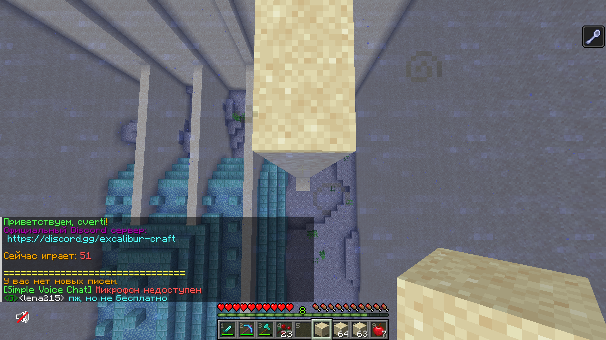

# py_sand_placer
Скрипт, который ставит блоки песка для осушения водных территорий

# Как установить:
## Windows:  
1. Установить Python:  
    a. Перейти по ссылке: https://www.python.org/downloads/, и скачать установщик  
    b. Запустить установку, обязательно не забыв поставить галочку добавления в PATH, а то придется ставить самому  
    c. Запустить новую (обязательно новую) командную строку, и проверить установку командой `python --version`  
2. Проверить наличие pip'a:  
    a. Ввести в командную строку команду `pip --version`. Если выводится версия, то все хорошо. Если нет,  
    b. Установить pip. Вот туториал: https://pythonru.com/baza-znanij/ustanovka-pip-dlja-python-i-bazovye-komandy  
3. Поставить необходимые библиотеки следющей командой:  
    a. `pip install -r requirements.txt`    
4. Скачать скрипт. Либо через `git clone`, либо просто скачать архив;
5. Перейти в консоли в папку скрипта;
6. Пробовать запустить скрипт комадной `python ./main.py`

# Как использовать:
1. Поменять следующие константы:  
`SELECT_BLOCK_KEY` - это кнопка выбора блока. По дефолту в майнкрафте стоит средняя кнопка мыши, но мне не нравится, так что у меня стоит другая. Если не меняли ее в биндах, поставьте это константе значение `Button.middle`  
`PLAYER_NAME` - ник игрока (нужно для открытия окна игры)  

2. Встать в позицию примерно как на картинке ниже:

3. Запустить скрипт как описано выше в пункте #6

4. Скрипт можно остановить нажатием кнопки F6
